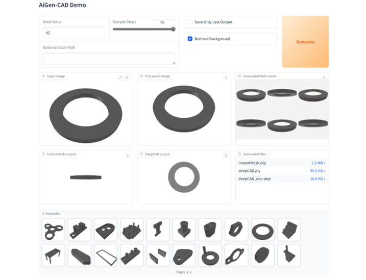

# AiGen-CAD: Gradio UI

This is the official **Gradio web interface** for the main **AiGen-CAD Project**.  
The app serves as a user-friendly frontend for the entire pipeline, allowing you to upload a 2D image and initiate the full reconstruction process into a 3D CAD model.

---

## 🧩 How It Works

The app orchestrates the entire pipeline by communicating with the separate **InstantMesh** and **DeepCAD** services:

1. **Upload:** A user uploads a 2D image.
2. **Call 1:** The image is sent to the _InstantMesh_ container to generate a 3D mesh.
3. **Call 2:** The resulting 3D object (as a point cloud) is sent to the _DeepCAD_ container.
4. **Result:** _DeepCAD_ generates a CAD command sequence. The app converts this into a final CAD model and makes it available for download.

---

## ⚙️ Prerequisites

Before the Gradio app can successfully process requests, the following conditions must be met:

### 🐳 Docker Services

- The `instantmesh` and `deepcad` containers must be running and have their API endpoints initialized.
- This is handled automatically by running:

```bash
  docker compose up
```

### 🧠 Model Checkpoints

- **InstantMesh:**  
  Models are automatically downloaded on the first run and cached in:  
  `../utils/models/InstantMesh/ckpts`

- **DeepCAD (Important):**  
  You must **manually download** the DeepCAD model checkpoint.  
  Follow the instructions in the DeepCAD README and extract the model into:  
  `../utils/models/DeepCAD/proj_log`

---

## 🚀 How to Run (Recommended)

The easiest way to start the entire application is by using **Docker Compose** from the project's root directory (the parent folder):

```bash
    $ docker compose up
```

This command will start all three containers:

- `app` (this Gradio UI)
- `instantmesh`
- `deepcad`

> **Important:** Please wait a few minutes after the first launch.  
> The `instantmesh` and `deepcad` containers need time to load their models and start their API endpoints.  
> The Gradio UI will only be fully functional after they are ready.

---

## 🌐 Accessing the UI

Once the containers are running, you can open the web interface in your browser at:

http://localhost:7860

---

## 🧰 Manual Start (for Development)

If you want to manually run the Gradio script inside the already-running container (for debugging or development):

1. Ensure the containers are running:

```bash
   $ docker compose up
```

2. Open a new terminal and access the app container shell:

```bash
   $ docker exec -it app bash
```

3. Inside the container, run the Gradio app:

```bash
   $ python app.py
```

---

## 🖼️ Example Demo

---

## 🔧 Troubleshooting (quick tips)

- If the UI shows errors contacting the services, verify both `instantmesh` and `deepcad` containers are healthy:
  - `docker ps` to check running containers.
  - `docker logs instantmesh` and `docker logs deepcad` for model-loading progress / errors.
- Ensure the DeepCAD checkpoint is in `../utils/models/DeepCAD/proj_log` and permissions allow the container to read it.
- If models fail to download automatically for InstantMesh, check container logs and network access.

---
