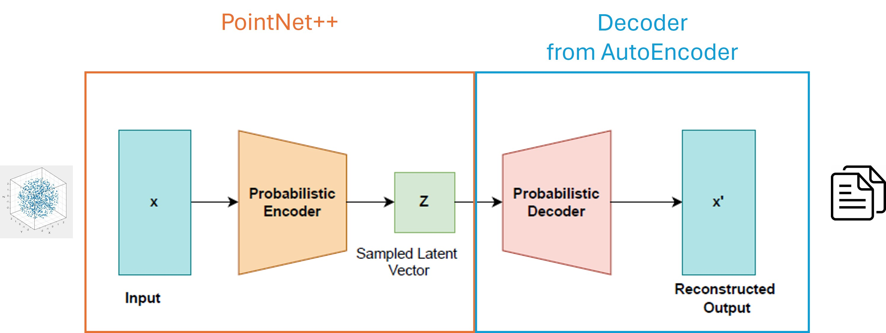
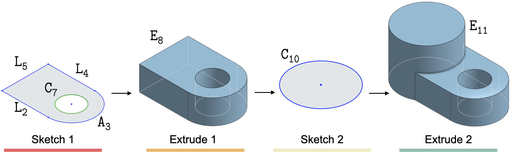
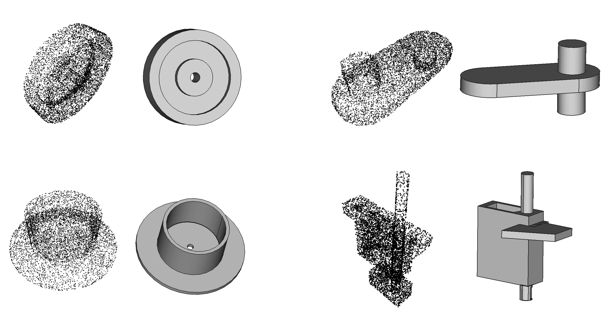

# DeepCAD

As second part of our AiGen - CAD Architecture we propose a Encoder - Decoder Architecture to reconstruct a CAD - Command Sequence from a 3D-Pointcloud.



The main problem of our project is to reconstruct a CAD - Command Sequence.



We therefore used the original DeepCAD - Model proposed by [Rundi Wu](https://chriswu1997.github.io), [Chang Xiao](http://chang.engineer), [Changxi Zheng](http://www.cs.columbia.edu/~cxz/index.htm) in the paper [DeepCAD: A Deep Generative Network for Computer-Aided Design Models](https://arxiv.org/abs/2105.09492) as a starting point, built upon it and adjusted it for our special Use-Case.

Link to the original Repository [DeepCAD](https://github.com/ChrisWu1997/DeepCAD)

## Prerequisites

- Linux
- NVIDIA GPU + CUDA CuDNN 11.8
- Python 3.10, PyTorch 2.2.2-cuda11.8

## Dependencies

Install python package dependencies through pip:

```bash
$ pip install -r requirements.txt
```

Install [pythonocc](https://github.com/tpaviot/pythonocc-core) (OpenCASCADE) by conda:

```bash
$ conda install -n base conda-libmamba-solver -y
$ conda install -c conda-forge pythonocc-core=7.7.2 --solver=libmamba -y
```

Install [PointNet++](https://github.com/erikwijmans/Pointnet2_PyTorch) through pip:

```bash
$ pip install "git+https://github.com/erikwijmans/Pointnet2_PyTorch#egg=pointnet2_ops&subdirectory=pointnet2_ops_lib"
```

## Docker

Install and run the app inside a Dockercontainer:

```bash
$ docker build -t deepcad .
$ docker exec -it deepcad bash
```

## Data

Download data from [kaggle](https://www.kaggle.com/datasets/vitalygladyshev/deepcad) and extract them under `data` folder.

- `cad_json` contains the original json files that we parsed from Onshape and each file describes a CAD construction sequence.
- `cad_vec` contains our vectorized representation for CAD sequences, which serves for fast data loading. They can also be obtained using `dataset/json2vec.py`.
- `pc_cad` contains the extracted Pointclouds from the original CAD-Model
- `train_val_test_split.json` the json - file containing indices used to split the trainingsdata

The data we used are parsed from Onshape public documents with links from [ABC dataset](https://archive.nyu.edu/handle/2451/61215).
If you want to train only the pcEncoder you need the vectors of the latent space. You can download [cad_all_zs](https://drive.google.com/file/d/1PhhCFhf9JuNi7AfjqV_f1wPLs0Sh7eIe/view?usp=sharing) and extract into the `data` folder.
We also provide a list of faulty models in the dataset which are getting filterd out while loading. You can find this list in `dataset/faulty_cad_models.json`

## Models

We provide three different Model classes:

- `AutoEncoder` is the pretrained Model available from the original DeepCAD. It takes a CAD - Construction Sequence and reconstructs it.
- `pcEncoder` based on the [PointNet++](https://github.com/erikwijmans/Pointnet2_PyTorch) Architecture extracts Features from a Pointcloud and encodes it into a latent space.
- `pc2cad` is our final Model proposed in this project. It combines the prior two Architectures into one coherent model. It takes a Pointcloud as input, encodes it into a latent space and reconstructs a CAD - Command Sequence with the Decoder-Part from the AutoEncoder.

### Pre-trained models

You can find available pretrained Checkpoints for all three models. Download the [Models](https://drive.google.com/drive/folders/1e9s5W81YH7RgqIV2yr-h61pDEQ6N4Kix?usp=sharing) and extract them into the `proj_log` folder. Please keep the following scheme.

- `proj_log/ae` AutoEncoder
- `proj_log/pce` pcEncoder
- `proj_log/pc2cad` pc2cad

## Model - Execution

The following explains how to train and evaluate the final `pc2cad` Architecture, as well as generate predictions in Inference. These procedures are the same for the other models and can be adapted 1:1.
<br>
The main entrypoint is `pc2cad.py` in the root directory. It orchestrates the different modes you want to run. By default it will be called via the CLI. At Inferece the model can also be accessed via a REST-API provided by `accesspoint.py`.
<br>
Bevor executing please configure the model hyper-parameters under `config` folder.

### Training

To train the Model with random initial weights:

```bash
$ python pc2cad.py --exec train --exp_name pc2cad --nr_epochs 1000 --batch_size 256 --n_points 8096 --noise --num_workers 8 -g 0
```

- `--exec train` sets the Execution-Type to Training
- `--exp_name` give the experiment a name
- `--nr_epochs` number Epochs you want to train
- `--batch_size` number of samples per batch
- `--n_points` number of points per input Pointcloud. If the set n_points is lower than the actual number of points, the given n_points will randomly be samples from the input. The files in the Traininsdata provided all consists of 8096 points.
- `--noise` Boolean: activates a random noise added to the input Pointcloud
- `--num_workers` number of threads used by dataloader
- `-g` set visible GPU-index

<br>

You can also load an existing Checkpoint and continue training. Therefore set the following flags:

- `--continue` Boolean: sets the mode to continue training from existing checkpoints
- `--ckpt` name of the checkpoint to continue from e.g. latest

<br>

Last you can also load pretrained AutoEncoder and pcEncoder - Checkpoints and continue training. Therefore set the following flags:

- `--continue` Boolean: sets the mode to continue training from existing checkpoints
- `--load_modular_ckpt` Boolean: activates loading of modular pcEncoder and AutoEncoder - Checkpoints
- `--pce_exp_name` the pcEncoder - Experiment which contains the pretrained models
- `--pce_ckpt` name of the pcEncoder - checkpoint to continue from e.g. latest
- `--ae_exp_name` the AutoEncoder - Experiment which contains the pretrained models
- `--ae_ckpt` name of the AutoEncoder - checkpoint to continue from e.g. latest

<br>

You can set the `validation frequency` and `save frequency` in the `config-file`. These will determine when the model will be evaluated and testen while training.
<br>

The trained Checkpoints and experment logs will be saved into `proj_log/pc2cad/{exp_name}/`
<br>
You can init a tensorboard to visualize the logs with the following command:

```bash
$ tensorboard --logdir proj_log/pc2cad/{exp_name}/log --host 0.0.0.0
```

### Evaluation

After training evaluate the model using:

```bash
$ python pc2cad.py --exec eval --mode acc --exp_name pc2cad --ckpt latest --n_points 8096 --num_worker 8 -g 0
$ python pc2cad.py --exec eval --mode cd --exp_name pc2cad --ckpt latest --n_points 8096 --num_worker 8 -g 0
$ python pc2cad.py --exec eval --mode gen --exp_name pc2cad --ckpt latest --n_points 8096 --num_worker 8 -g 0
```

- `--exec eval` sets the Execution-Type to Evaluation
- `--exp_name` the name of the experiment to evaluate
- `--ckpt` the exact Checkpoint to evaluate
- `--n_points` number of points per input Pointcloud. If the set n_points is lower than the actual number of points, the given n_points will randomly be samples from the input. The files in the Traininsdata provided all consists of 8096 points.
- `--mode` choose one of the three different evaluation modes.
- `--mode acc` for command accuray and parameter accuracy.
- `--mode cd` for chamfer distance.
- `--mode gen` for evaluation by COV, MMD and JSD.

<br>

If you run the evaluation via the main-skript `pc2cad` it uses the `train-split` from the traininsdata.
You can also run these files on your own generated data. Therefore use the skripts provided in the `evaluation` folder.

<br>

All the results will be saved to `proj_log/pc2cad/{exp_name}/evaluation`

### Inference

To generate a CAD - Command Sequence from a Pointcloud use following command:

```bash
$ python pc2cad.py --exec inf --exp_name pc2cad_Exp --ckpt latest --pc_root data/cad_pc/0044/00440420.ply --n_points 8096 --output ./results  --expSTEP --expPNG --expGIF -g 0
```

- `--exec inf` sets the Execution-Type to Inference
- `--exp_name` the name of the experiment
- `--ckpt` the exact Checkpoint to use for the prediction
- `--pc_root` the input Pointcloud to reconstruct a CAD Sequence from. Can be a directory or exact filename
- `--n_points` number of points per input Pointcloud. If the set n_points is lower than the actual number of points, the given n_points will randomly be samples from the input. The files in the Traininsdata provided all consists of 8096 points.
- `--expSTEP` activate automatic conversion from output-vector to .STEP - File
- `--expPNG` activate automatic export of a PNG-file of the result
- `--expGIF` activate automatic export of a GIF-file of the result
- `--expOBJ` activate automatic export of a OBJ-file of the result
- `-g` GPU-index to use

<br>

By default the results will be saved to `proj_log/pc2cad/{exp_name}/results`. You can set a custom output-path with the `--output` flag.

## Visualization and Export of Results

We provide scripts to visualize CAD models and export the results to `.step` files, which can be loaded by almost all modern CAD softwares, as well as exporting renders of the CAD - Model.

<br>

To visualize the predicted model run:

```bash
$ python utils/show.py --src {source folder} # visualize with opencascade
```

You can convert the predicted vector to the correct filetype needed by either specifying the correspoding flags in Inference-Mode or by running the correct standalone skript.

- `utils/seq2step.py` converts the predicted vector to a CAD - Command Sequence to a .STEP file describing the resulting BRep-Model
- `utils/step2render.py` converts the predicted .STEP file into a Mesh-Object which can be rendered and saved as either PNG, GIF or OBJ - File

There are also a few more skripts which are used for internal filetype conversions but can also be called manually.

- `dataset/json2vec.py` this file converts a CAD - Command Sequence from json format to a vector
- `dataset/json2pc.py` this file converts a CAD - Command Sequence from json format to a pointcloud
- `dataset/vec2pc.py` this file converts a CAD - Command Sequence from vectors to a pointcloud

## Example Results

<p align="center">
  
</p>

## Acknowledgement

We would like to thank and acknowledge referenced code and work from [DeepCAD](https://github.com/ChrisWu1997/DeepCAD).
