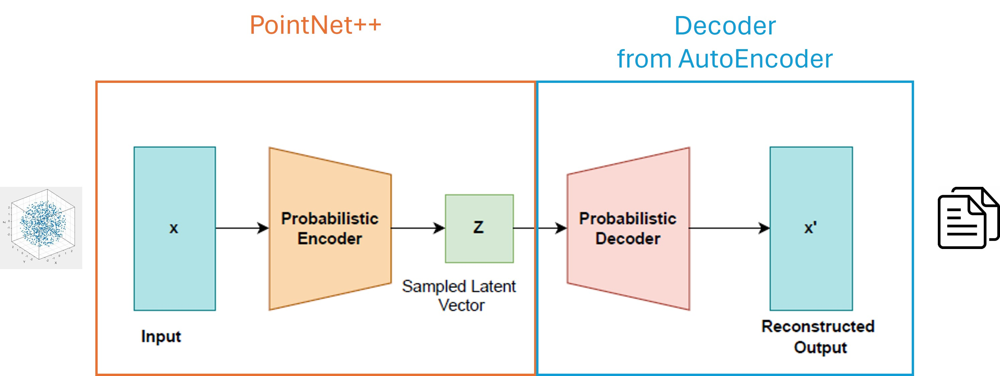
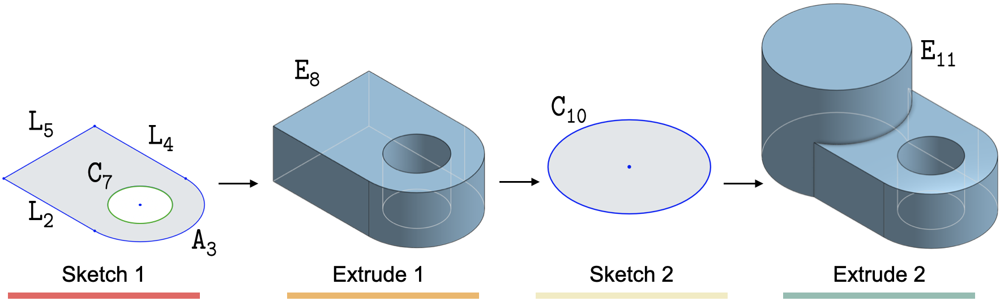
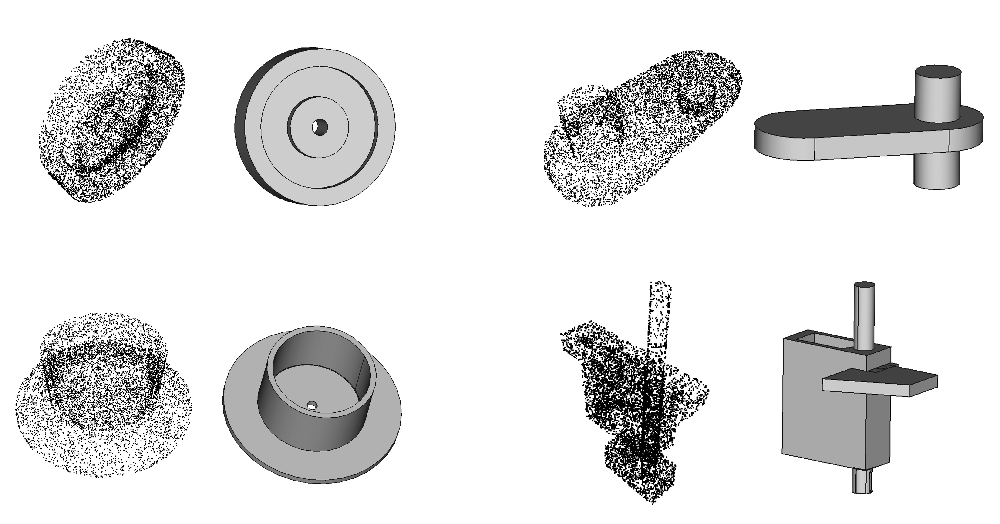

# DeepCAD

This is the second part of our AiGen-CAD architecture. We propose an Encoder-Decoder architecture to reconstruct a CAD command sequence from a 3D point cloud.



The main problem of our project is the reconstruction of a CAD command sequence.



We used the original DeepCAD-Model proposed by [Rundi Wu](https://chriswu1997.github.io), [Chang Xiao](http://chang.engineer), and [Changxi Zheng](http://www.cs.columbia.edu/~cxz/index.htm) in the paper [DeepCAD: A Deep Generative Network for Computer-Aided Design Models](https://arxiv.org/abs/2105.09492) as a starting point, built upon it, and adjusted it for our special use-case.

Link to the original Repository: [DeepCAD](https://github.com/ChrisWu1997/DeepCAD)

---

## 🚀 Getting Started

### Prerequisites

- Linux
- NVIDIA GPU + CUDA CuDNN 11.8
- Python 3.10
- PyTorch 2.2.2 (for CUDA 11.8)

### 1. Manual Installation

1.  **Python Dependencies (pip):**
    Install most dependencies via `requirements.txt`:

    ```bash
    $ pip install -r requirements.txt
    ```

2.  **PythonOCC (Conda):**
    Install [pythonocc](https://github.com/tpaviot/pythonocc-core) (OpenCASCADE) via Conda, as this is often more reliable:

    ```bash
    $ conda install -n base conda-libmamba-solver -y
    $ conda install -c conda-forge pythonocc-core=7.7.2 --solver=libmamba -y
    ```

3.  **PointNet++ (pip):**
    Install the [PointNet++](https://github.com/erikwijmans/Pointnet2_PyTorch) operators directly from GitHub:
    ```bash
    $ pip install "git+[https://github.com/erikwijmans/Pointnet2_PyTorch#egg=pointnet2_ops&subdirectory=pointnet2_ops_lib](https://github.com/erikwijmans/Pointnet2_PyTorch#egg=pointnet2_ops&subdirectory=pointnet2_ops_lib)"
    ```

### 2. Docker Installation (Alternative)

You can also build and run the app inside a Docker container:

```bash
# Build the image from the Dockerfile in this directory
$ docker build -t deepcad .

# Start the container and access its shell
$ docker exec -it deepcad bash
```

_(Note: This method is for standalone development. For the complete pipeline, `docker compose` in the project's root directory is recommended.)_

---

## 📦 Data & Models

### Data

1.  **DeepCAD Dataset:** Download the data from [Kaggle](https://www.kaggle.com/datasets/vitalygladyshev/deepcad) and extract it into the `data` folder.

    - `cad_json`: Contains the original JSON files from Onshape.
    - `cad_vec`: Vectorized CAD sequences for faster loading (can also be generated with `dataset/json2vec.py`).
    - `pc_cad`: Extracted point clouds from the CAD models.
    - `train_val_test_split.json`: JSON file with indices for the dataset split.

2.  **(Optional) Latent Space Vectors:** If you only want to train the `pcEncoder`, you need the latent space vectors. Download [cad_all_zs](https://drive.google.com/file/d/1PhhCFhf9JuNi7AfjqV_f1wPLs0Sh7eIe/view?usp=sharing) and extract them into the `data` folder.

We also provide a list of faulty models (`dataset/faulty_cad_models.json`) that are filtered out during loading.

### Pre-trained Models

Download our pre-trained checkpoints for all three model types [here](https://drive.google.com/drive/folders/1e9s5W81YH7RgqIV2yr-h61pDEQ6N4Kix?usp=sharing).

Extract them into the `proj_log` folder, maintaining the following structure:

- `proj_log/ae`: AutoEncoder model
- `proj_log/pce`: pcEncoder model
- `proj_log/pc2cad`: pc2cad model (combined)

---

## 🧠 Model Architectures

We provide three different model classes:

1.  **`AutoEncoder`**: The pre-trained model from the original DeepCAD. It takes a CAD construction sequence and reconstructs it.
2.  **`pcEncoder`**: Based on the [PointNet++](https://github.com/erikwijmans/Pointnet2_PyTorch) architecture. It extracts features from a point cloud and encodes them into a latent space.
3.  **`pc2cad`**: Our final model proposed in this project. It combines the two previous architectures. It takes a point cloud as input, encodes it, and reconstructs a CAD command sequence using the Decoder part of the AutoEncoder.

---

## ⚙️ Model Execution (pc2cad.py)

The following explains how to train, evaluate, and use the final `pc2cad` architecture for inference. These procedures are identical for the other models and can be adapted 1:1.

The main entry point is `pc2cad.py` in the root directory. Before you begin, please configure the model hyperparameters in the `config` folder.

For inference, the model can also be accessed via a REST-API provided by `accesspoint.py`.

### Training

To train the model with random initial weights:

```bash
$ python pc2cad.py --exec train --exp_name pc2cad --nr_epochs 1000 --batch_size 256 --n_points 8096 --noise --num_workers 8 -g 0
```

**Arguments:**

- `--exec train`: Sets the execution type to Training.
- `--exp_name`: Gives the experiment a name.
- `--nr_epochs`: Number of epochs to train.
- `--batch_size`: Number of samples per batch.
- `--n_points`: Number of points per input point cloud. The provided training data consists of 8096 points.
- `--noise`: (Boolean) Adds random noise to the input point cloud.
- `--num_workers`: Number of threads used by the dataloader.
- `-g`: Sets the index of the visible GPU.

#### Continue Training

You can also load an existing checkpoint and continue training. To do so, set the following flags:

- `--continue`: (Boolean) Sets the mode to "Continue Training".
- `--ckpt`: Name of the checkpoint to continue from (e.g., `latest`).

#### Training with Pre-trained Modules

Load pre-trained `AutoEncoder` and `pcEncoder` checkpoints and continue training:

- `--continue`: (Boolean) Sets the mode to "Continue Training".
- `--load_modular_ckpt`: (Boolean) Activates loading of modular checkpoints.
- `--pce_exp_name`: The `pcEncoder` experiment containing the models.
- `--pce_ckpt`: Name of the `pcEncoder` checkpoint (e.g., `latest`).
- `--ae_exp_name`: The `AutoEncoder` experiment containing the models.
- `--ae_ckpt`: Name of the `AutoEncoder` checkpoint (e.g., `latest`).

#### Logging

Trained checkpoints and logs are saved in `proj_log/pc2cad/{exp_name}/`. You can set the `validation frequency` and `save frequency` in the `config` file.

Start TensorBoard to visualize the logs:

```bash
$ tensorboard --logdir proj_log/pc2cad/{exp_name}/log --host 0.0.0.0
```

### Evaluation

After training, evaluate the model using one of the following modes:

```bash
# Mode 1: Command and parameter accuracy
$ python pc2cad.py --exec eval --mode acc --exp_name pc2cad --ckpt latest --n_points 8096 --num_worker 8 -g 0

# Mode 2: Chamfer distance
$ python pc2cad.py --exec eval --mode cd --exp_name pc2cad --ckpt latest --n_points 8096 --num_worker 8 -g 0

# Mode 3: COV, MMD, and JSD
$ python pc2cad.py --exec eval --mode gen --exp_name pc2cad --ckpt latest --n_points 8096 --num_worker 8 -g 0
```

**Arguments:**

- `--exec eval`: Sets the execution type to Evaluation.
- `--exp_name`: The name of the experiment to evaluate.
- `--ckpt`: The exact checkpoint to evaluate.
- `--mode`: Selects one of the three evaluation modes (`acc`, `cd`, `gen`).

All results are saved in `proj_log/pc2cad/{exp_name}/evaluation`. You can also run these scripts with your own data by using the scripts in the `evaluation` folder.

### Inference

To generate a CAD command sequence from a point cloud:

```bash
$ python pc2cad.py --exec inf --exp_name pc2cad_Exp --ckpt latest --pc_root data/cad_pc/0044/00440420.ply --n_points 8096 --output ./results --expSTEP --expPNG --expGIF -g 0
```

**Arguments:**

- `--exec inf`: Sets the execution type to Inference.
- `--exp_name`: The name of the experiment.
- `--ckpt`: The exact checkpoint to use for prediction.
- `--pc_root`: The input point cloud (directory or exact filename).
- `--n_points`: Number of points per input point cloud.
- `--output`: (Optional) A custom output path. (Default: `proj_log/pc2cad/{exp_name}/results`)
- `--expSTEP`: (Boolean) Activates automatic conversion of the output to a `.STEP` file.
- `--expPNG`: (Boolean) Activates automatic export of a PNG file of the result.
- `--expGIF`: (Boolean) Activates automatic export of a GIF file of the result.
- `--expOBJ`: (Boolean) Activates automatic export of an OBJ file of the result.
- `-g`: GPU index to use.

---

## 🛠️ Visualization and Export

We provide scripts to visualize CAD models and export the results.

### Visualization and Conversion

- **`utils/show.py`**: Visualizes a model using OpenCASCADE.
  ```bash
  $ python utils/show.py --src {source_folder}
  ```
- **`utils/seq2step.py`**: Converts the predicted vector (sequence) into a `.STEP` file (BRep model).
- **`utils/step2render.py`**: Converts the `.STEP` file into a mesh object and saves it as `.PNG`, `.GIF`, or `.OBJ`.

### Internal Data Conversion

These scripts are used internally but can also be called manually:

- **`dataset/json2vec.py`**: Converts a CAD command sequence from JSON format to a vector.
- **`dataset/json2pc.py`**: Converts a CAD command sequence from JSON format to a point cloud.
- **`dataset/vec2pc.py`**: Converts a CAD command sequence from vectors to a point cloud.

---

## ✨ Example Results

<p align="center">
  
</p>

## 🙏 Acknowledgement

We would like to thank and acknowledge the authors of [DeepCAD](https://github.com/ChrisWu1997/DeepCAD) for their code and work.

---
