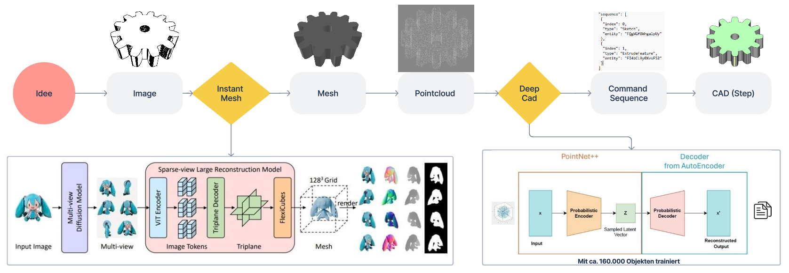

# AiGen-CAD - Generative AI for 3d modeling

This project was developed as part of a Master's program in Artificial Intelligence and Computer Vision at the [Kempten University of Applied Sciences](https://www.hs-kempten.de/en/) in cooperation with the [Institute for Data-optimised Manufacturing (IDF)](https://www.hs-kempten.de/en/research/research-institutes/institute-for-data-optimized-manufacturing-idf).

**Project members**: [Christoph Zengerle](https://github.com/christophzengerle), [Jorge Mandlmaier](https://github.com/huber-jr)

## Introduction

The main goal of the project was the development of a pipeline to reconstruct a CAD-Sequence from an Image-Input.



Therefore first a 3D-Geometry is generated from the 2D-Image by InstantMesh. Afterwards the 3D-Object in form of a Pointcloud is fed into DeepCAD. DeepCAD reconstructs a CAD-Command-Sequence from the Pointcloud. The final CAD-Model can be constructed from this Sequence.

## Project structure:

```
AiGen_CAD
│   docker-compose.yaml
│
│
└───App (Gradio UI)
│       │   Dockerfile
│       │   requirements.txt
│       │   ...
│
└───DeepCAD
│       │   Dockerfile
│       │   requirements.txt
│       │   ...
│
└───InstantMesh
│       │   Dockerfile
│       │   requirements.txt
│       │   ...
```

Every subdirectory has its own Dockerfile and requirements.txt to initiate Docker Container.
Every subdirectory is mounted to their respective container when building the container with Docker Compose.

## Docker

The easiest way to startup the Pipeline is with the provided Dockerfiles.

Running

```bash
$ docker compose up
```

in the root directory starts all 3 container for InstantMesh, DeepCAD and the GradioUI.
The access point scripts of InstantMesh and DeepCAD will be executed automatically.
To access the Container bash run "docker exec -it {container_name} bash".

The Containernames are:

- app
- instantmesh
- deepcad

The structure inside of the containers is like:

```
usr
│
└───/local/cuda (only for DeepCAD. CudaHome directory)
│
└───/app/src
    │
    └───miniconda3
    │
    └───InstantMesh/App/DeepCAD (mounte from respective subdirectory)
        │
        └───data (mounted from ../utils/data)
        │
        └───ckpts/proj_log (mounted from ../utils/models/{InstantMesh/DeepCAD})
        │
        └───results (mounted from ../utils/results
```

The docker-compose.yaml manages the ports for every container. The App container has SSH and Gradio Ports.
The InstantMesh and DeepCAD container have SSH, Flask and Tensorboard ports each.

## App

To start the Pipeline you first need to wait until the access points of InstantMesh and DeepCAD are loaded.
If no cached models are available downloading and initializing the models can take a few minutes.
Cashed models will me saved in the _proj_log_ folder for DeepCAD and the _ckpts_ folder for InstantMesh.
These folders are mounted so the cached models should be available even after container restart.
To run the Gradio UI log into the App container via bash as descriped in **Docker** and run

```bash
$ python app.py
```

The App can be accessed on localhost via Port 7860 (localhost:7860) or with the public Gradio-URL provided on startup and displayed in the Terminal.

<br>

### **Further Informations about the Models and on how to train or run InstantMesh or DeepCAD please have a look at the Readme in the specific Model-Folder**

<br>

## Data Transformation

### Command Sequence (.json/.h5) to CAD (.step)

file: DeepCAD/utils/seq2step.py  
Takes Commands Sequences as input and transforms them to Mesh in OBJ-format.

Parameters:

- **src : str, default=None**  
  Source file or folder (takes every .json/.h5 file in the directory as input)
- **dest: str, default="step_files"**  
  Destination folder. Is created if it doesn't exist.
- **type: str, default=h5, choices=[h5, json]**  
  Select file format of input (json or h5)
- **check: bool, default=None**  
  Use opencascade analyzer to filter invalid model
  select file format of input (json or h5)

### CAD (.step) to Mesh (.obj)

file: InstantMesh/src/utils/step2obj.py  
Takes CAD Step-Files as input and transforms it to Mesh in OBJ-format.

Parameters:

- **src : str, default=None**  
  Source file or folder (takes every .step file in the directory as input)
- **dest: str, default="png_files"**  
  Destination folder. Is created if it doesn't exist.

### CAD or Mesh (.step/.obj) to Pointcloud (.ply)

file: InstantMesh/src/utils/step2pc.py  
Takes CAD Step-Files or Mesh OBJ-Files and transforms them to Pointclouds in PLY-format.

Parameters:

- **src : str, default=None**  
  Source file or folder (takes every .step/.obj file in the directory as input)
- **dest: str, default="ply_files"**  
  Destination folder. Is created if it doesn't exist.
- **n_points: int, default=8096**  
  Number of points to sample for Pointcloud.

### CAD, Mesh or Pointcloud (.step/.obj/.ply) to Image/Video (.png/.gif)

file: DeepCAD/utils/step2render.py  
Takes CAD Step-Files, Mesh OBJ-Files or Pointcloud PLY-Files and transforms them to rendered Image or Video. Can also save input as OBJ-File.

Parameters:

- **src : str, default=None**  
  Source file or folder (takes every .step/.obj/.ply file in the directory as input)
- **dest: str, default="png_files"**  
  Destination folder. Is created if it doesn't exist.
- **ele: int, default=45**  
  Camera elevation.
- **rot: int, default=-45**  
  Camera rotation.
- **png: bool, default=False**  
  If True renders and saves PNG-File.
- **gif: bool, default=False**  
  If True renders and saves GIF-File.
- **obj: bool, default=False**  
  If True saves Mesh as OBJ-File.
- **qual: str, default="low", choices=["low", "medium", "high"]**  
  Quality of render. Low is 300, medium 600 and high 1200 pixel.

### Mesh (.obj) to Edge-Image, Depth-Image and Normal-Image (.png)

file: InstantMesh/src/utils/mesh2instant.py  
Takes Mesh OBJ-File and renders Edge-, Depth- and Normal-Image.
Takes train-test-split Json-File as input and saves filenames of split in
_val_objs.json_ under keywords _good_objs_, _val_objs_, _test_objs_ and _failed_objs_ for files where render failes.

Parameters:

- **src : str, default=None**  
  Source file or folder (takes every .step/.obj file in the directory as input)
- **dest: str, default="png_files"**  
  Destination folder. Is created if it doesn't exist.
- **res: str, default="low", choices=["low", "medium", "high"]**  
  Quality of render. Low is 300, medium 600 and high 1200 pixel.
- **split: str, is required**  
  Train-test-split file. Structure like dict: {"train": [{folder}/{file}, {folder}/{file},...], "val": [...], "test": [...]}  
  Filename without file ending! Folder path in relation to src folder!
