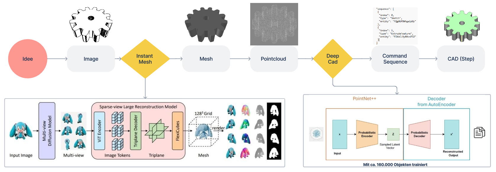
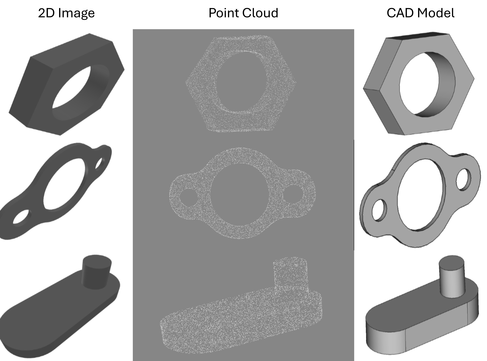

# AiGen-CAD: Generative AI for 3D Modeling

This project was developed as part of a Master's program in Artificial Intelligence and Computer Vision at the [Kempten University of Applied Sciences](https://www.hs-kempten.de/en/) in cooperation with the [Institute for Data-optimised Manufacturing (IDF)](https://www.hs-kempten.de/en/research/research-institutes/idf-the-institute).

**Project members**: [Christoph Zengerle](https://github.com/christophzengerle), [Jorge Mandlmaier](https://github.com/huber-jr)

---

## 🚀 Introduction

The main goal of the project was the development of a pipeline to reconstruct a CAD command sequence from an image input.



To achieve this, a 3D geometry is first generated from the 2D image using **InstantMesh**. Afterwards, the 3D object, in the form of a point cloud, is fed into **DeepCAD**. DeepCAD reconstructs a CAD command sequence from the point cloud. The final CAD model can be constructed from this sequence.

---

## ⚡ Quick Start (Docker Compose)

The easiest way to start the entire pipeline is via Docker Compose.

### Prerequisites

1.  **Docker & Docker Compose:** Must be installed on your system.
2.  **DeepCAD Model (Manual):** You must download the DeepCAD model checkpoint manually.
    - Follow the instructions in the `DeepCAD/README.md`.
    - Extract the model into the `utils/models/DeepCAD/proj_log/` folder.
3.  **InstantMesh Models (Automatic):** These models will be downloaded automatically on the first run and cached in `utils/models/InstantMesh/ckpts/`.

### Running the App

1.  Clone this repository (if you haven't already).
2.  Ensure you have downloaded the DeepCAD models as described above.
3.  Start all services from the project's root directory:

    ```bash
    $ docker compose up
    ```

4.  **Wait a few minutes.** The `instantmesh` and `deepcad` containers need to load their models and start their API endpoints. The InstantMesh model download may also take time on the first run.
5.  Open the Gradio web interface in your browser:
    **[http://localhost:7860](http://localhost:7860)**

---

## 📂 Project Structure

All subdirectories (`App`, `DeepCAD`, `InstantMesh`) contain their own `Dockerfile` and `requirements.txt` files to initialize the Docker containers. The `utils` folders are mounted into the respective containers via volumes.

The following is the directory layout of the **AiGen-CAD** project:

```
AiGen_CAD/
├── docker-compose.yaml
│
├── App/                      # Gradio UI Frontend
│   ├── Dockerfile
│   ├── requirements.txt
│   └── app.py
│
├── DeepCAD/                  # DeepCAD service (CAD reconstruction)
│   ├── Dockerfile
│   ├── ...
│   └── utils/
│       ├── seq2step.py       # Convert command sequences → STEP
│       └── step2render.py    # Render CAD/Mesh/Point Cloud → image or video
│
├── InstantMesh/              # InstantMesh service (Mesh generation)
│   ├── Dockerfile
│   ├── ...
│   └── src/utils/
│       ├── mesh2instant.py   # Mesh → edge/depth/normal image
│       ├── step2obj.py       # STEP → OBJ mesh
│       └── step2pc.py        # STEP/OBJ → PLY point cloud
│
└── utils/
    ├── data/                 # Raw data for training and testing
    ├── models/               # Mounted model checkpoints
    │   ├── DeepCAD/
    │   │   └── proj_log/     # Place DeepCAD model here manually
    │   └── InstantMesh/
    │       └── ckpts/        # Automatically downloaded models
    └── results/              # Mounted save directory for outputs
```

> **For further information** about the models and on how to train or run InstantMesh or DeepCAD, please have a look at the **README files in the specific model folders**.

---

## 🐳 Docker Details

### Container Names

- `app` (Gradio UI)
- `instantmesh`
- `deepcad`

### Accessing the Container Shell

To access the bash shell of a running container (e.g., for debugging):

```bash
$ docker exec -it [container_name] bash

# Example:
$ docker exec -it app bash
```

### Internal Container Structure

The directory structure inside the containers is as follows:

```
/
├── usr/local/cuda/  (Only for DeepCAD. CUDA_HOME directory)
│
└── app/src/
    ├── miniconda3/
    │
    └── ├── [InstantMesh | App | DeepCAD]/  (Mounted from host subdirectory)
        │
        ├── data/        (Mounted from ../utils/data)
        ├── ckpts/       (For InstantMesh, mounted from ../utils/models/InstantMesh/ckpts)
        ├── proj_log/    (For DeepCAD, mounted from ../utils/models/DeepCAD/proj_log)
        └── results/     (Mounted from ../utils/results)
```

## 🔌 Ports

The `docker-compose.yaml` manages the ports for each container:

| Container       | Ports & Services                                 |
| --------------- | ------------------------------------------------ |
| **App**         | SSH and Gradio ports _(Gradio on port **7860**)_ |
| **InstantMesh** | SSH, Flask (API), and TensorBoard ports          |
| **DeepCAD**     | SSH, Flask (API), and TensorBoard ports          |

---

## 🛠️ Data Conversion Scripts

These scripts are used to convert data between different CAD and mesh formats.

### Command Sequence (.json / .h5) → CAD (.step)

**File:** `DeepCAD/utils/seq2step.py`  
**Description:** Takes command sequences as input and transforms them into a CAD mesh in **OBJ format**.

**Parameters:**
| Parameter | Type | Default | Description |
|------------|------|----------|--------------|
| `--src` | str | `None` | Source file or folder (processes every `.json` or `.h5` file in the directory). |
| `--dest` | str | `"step_files"` | Destination folder (is created if it doesn't exist). |
| `--type` | str | `h5` | Input file format. Choices: `[h5, json]`. |
| `--check` | bool | `None` | Uses the OpenCASCADE analyzer to filter invalid models. |

─────────────────────────────────────────────────

### CAD (.step) → Mesh (.obj)

**File:** `InstantMesh/src/utils/step2obj.py`  
**Description:** Takes CAD STEP files as input and transforms them into meshes in **OBJ format**.

**Parameters:**
| Parameter | Type | Default | Description |
|------------|------|----------|--------------|
| `--src` | str | `None` | Source file or folder (processes every `.step` file in the directory). |
| `--dest` | str | `"png_files"` | Destination folder (is created if it doesn't exist). |

─────────────────────────────────────────────────

### CAD or Mesh (.step / .obj) → Point Cloud (.ply)

**File:** `InstantMesh/src/utils/step2pc.py`  
**Description:** Converts CAD STEP or Mesh OBJ files into **point clouds** in PLY format.

**Parameters:**
| Parameter | Type | Default | Description |
|------------|------|----------|--------------|
| `--src` | str | `None` | Source file or folder (processes every `.step` or `.obj` file in the directory). |
| `--dest` | str | `"ply_files"` | Destination folder (is created if it doesn't exist). |
| `--n_points` | int | `8096` | Number of points to sample for the point cloud. |

─────────────────────────────────────────────────

### CAD, Mesh, or Point Cloud (.step / .obj / .ply) → Image / Video (.png / .gif)

**File:** `DeepCAD/utils/step2render.py`  
**Description:** Renders CAD, Mesh, or Point Cloud files into **images or videos**. Can also export the mesh as an OBJ file.

**Parameters:**
| Parameter | Type | Default | Description |
|------------|------|----------|--------------|
| `--src` | str | `None` | Source file or folder. |
| `--dest` | str | `"png_files"` | Destination folder. |
| `--ele` | int | `45` | Camera elevation. |
| `--rot` | int | `-45` | Camera rotation. |
| `--png` | bool | `False` | If `True`, renders and saves a PNG image. |
| `--gif` | bool | `False` | If `True`, renders and saves a GIF animation. |
| `--obj` | bool | `False` | If `True`, saves the mesh as an OBJ file. |
| `--qual` | str | `"low"` | Render quality. Choices: `["low", "medium", "high"]`. _(low=300px, medium=600px, high=1200px)_ |

─────────────────────────────────────────────────

### Mesh (.obj) → Edge, Depth, and Normal Images (.png)

**File:** `InstantMesh/src/utils/mesh2instant.py`  
**Description:** Takes Mesh OBJ files and renders **edge**, **depth**, and **normal** images.  
Also supports train-test-split JSON files for dataset preparation.

**Parameters:**
| Parameter | Type | Default | Description |
|------------|------|----------|--------------|
| `--src` | str | `None` | Source file or folder. |
| `--dest` | str | `"png_files"` | Destination folder. |
| `--res` | str | `"low"` | Render quality. Choices: `["low", "medium", "high"]`. |
| `--split` | str | _(required)_ | Train-test-split JSON file. Structure like:<br>`{"train": ["{folder}/{file}", ...], "val": [...], "test": [...]}`.<br>Filenames are used **without extensions**. |

---

## 🖼️ Example Results



---
